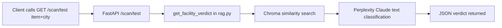

# Bin Sentinel Dolphin File

This file documents the current technology stack and runtime data flow implemented in the repository.

## 1) Technology Stack (Current Implementation)

### Backend
- Language/runtime: Python 3.11 (`backend/Dockerfile`)
- API framework: FastAPI (`backend/main.py`)
- Server: Uvicorn (`backend/Dockerfile`, `backend/requirements.txt`)
- CORS: FastAPI `CORSMiddleware` with wildcard origins/methods/headers (`backend/main.py`)
- Database ORM: SQLModel (`backend/models.py`, `backend/database.py`)
- Database engine: SQLite via `DATABASE_URL` (`backend/database.py`)
- AI provider/client: Perplexity official Python SDK (`backend/classify.py`)
- AI model: `anthropic/claude-sonnet-4-6` (`backend/classify.py`)
- Multimodal classification: image + full city MRF text in one model call (`backend/classify.py`)
- Optional RAG test path: LangChain + ChromaDB + sentence-transformers (`backend/rag.py`, `backend/ingest.py`, `backend/requirements.txt`)

### Frontend (Web)
- Framework: React 19 (`frontend/package.json`)
- Build tooling: Vite 7 (`frontend/package.json`)
- Styling: Tailwind CSS 3 (`frontend/package.json`)
- HTTP client: Axios (`frontend/package.json`, `frontend/src/CameraFeed.jsx`)
- In-browser object detection: TensorFlow.js + COCO-SSD (`frontend/src/CameraFeed.jsx`)
- Active entry UI: `CameraFeed` (not `Scanner`) (`frontend/src/App.jsx`, `frontend/src/CameraFeed.jsx`)

### iPad App (Native)
- UI framework: SwiftUI (`BinSentinelIPad/BinSentinelIPad/Views/ScannerView.swift`)
- Camera framework: AVFoundation (`BinSentinelIPad/BinSentinelIPad/Services/CameraService.swift`)
- Networking: `URLSession` multipart upload client (`BinSentinelIPad/BinSentinelIPad/Services/APIClient.swift`)
- Architecture style: View + ViewModel + Service layering (`BinSentinelIPad/BinSentinelIPad/ViewModels/ScanViewModel.swift`)
- Optional auto-city input: CoreLocation-based closest city logic (`BinSentinelIPad/BinSentinelIPad/Services/LocationCityProvider.swift`)

### Deployment and Runtime Config
- Backend containerization: Docker (`backend/Dockerfile`)
- Backend hosting target: Railway (`backend/README_DEPLOY.md`)
- Frontend hosting target: Vercel (`backend/README_DEPLOY.md`, `frontend/vercel.json`)
- API base URL config:
  - Web: `VITE_API_URL` fallback to `http://localhost:8000` (`frontend/src/CameraFeed.jsx`)
  - iPad: `ServerURLSettings` / `AppConfig` (`BinSentinelIPad/BinSentinelIPad/Config/ServerURLSettings.swift`)

## 2) API Surface and Contracts in Use

- `POST /scan` (multipart form):
  - Inputs: `image` file, `city` form field (`backend/main.py`)
  - Validation: city whitelist, image MIME, max size, non-empty file (`backend/main.py`, `backend/models.py`)
  - Outputs: `item`, `action`, `reason`, `confidence`, `city` (`backend/main.py`)
- `GET /history`:
  - Output: last 10 saved scans (`backend/main.py`)
- `GET /health`:
  - Output: `{ "status": "ok" }` (`backend/main.py`)
- `GET /scan/test`:
  - Text-only test path through RAG pipeline (`backend/main.py`, `backend/rag.py`)

## 3) End-to-End Data Flow

### A. Web Camera Flow (Production)

```mermaid
flowchart LR
    U[User in browser] --> W1[CameraFeed React component]
    W1 --> W2[getUserMedia rear camera stream]
    W2 --> W3[TFJS + COCO-SSD detection loop]
    W3 --> W4[Capture frame to canvas as JPEG blob]
    W4 --> W5[POST /scan with FormData image+city]

    W5 --> B1[FastAPI /scan endpoint]
    B1 --> B2[Validate city, MIME, size, non-empty]
    B2 --> B3[classify_image image+city]
    B3 --> B4[Load city MRF text from backend/data]
    B4 --> B5[Perplexity responses.create]
    B5 --> B6[Claude returns JSON verdict]
    B6 --> B7[Parse/normalize response]
    B7 --> B8{action == N/A?}
    B8 -- no --> B9[Persist scan in SQLite via SQLModel]
    B8 -- yes --> B10[Skip DB write]
    B9 --> B11[Return JSON response]
    B10 --> B11

    B11 --> W6[Show ResultOverlay in UI]
    W6 --> W7[Increment history key]
    W7 --> W8[History component GET /history]
    W8 --> U
```

### B. iPad Flow (Production)

```mermaid
flowchart LR
    I1[ScannerView SwiftUI] --> I2[CameraService AVFoundation session]
    I2 --> I3[Manual or auto capture trigger]
    I3 --> I4[ScanViewModel submitScan]
    I4 --> I5[APIClient multipart POST /scan]
    I5 --> B1[FastAPI /scan]
    B1 --> B2[classify_image via Perplexity Claude]
    B2 --> B3[Optional SQLite persistence]
    B3 --> I6[ScanResult decode in iPad app]
    I6 --> I7[ResultOverlayView verdict popup]
    I7 --> I8[fetchHistory GET /history]
```

### C. Text-Only Test Flow (RAG Endpoint)

## 4) Stored Data and Key Artifacts

- SQLite table: `Scan` records item/action/reason/confidence/city/timestamp/model/latency (`backend/models.py`)
- MRF policy sources: city text files in `backend/data/*.txt` (`backend/classify.py`)
- Optional vector index: local Chroma persistence directory for RAG (`backend/ingest.py`, `backend/rag.py`)

## 5) Notes on Current Behavior

- The production `POST /scan` path does not require vector retrieval; it sends full city MRF text directly with the image (`backend/classify.py`).
- The RAG/Chroma path is currently used by `/scan/test` and optional retrieval workflows (`backend/rag.py`, `backend/main.py`).
- The web app currently renders `CameraFeed` as the active scanning UI (`frontend/src/App.jsx`).
